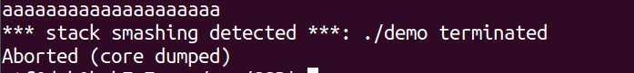

# ⚔️⚔️slime's War⚔️⚔️
> Author: 堇姬Naup

tag: `pwn`

## 分析
```c
#include <stdio.h>
#include <stdlib.h>
#include <unistd.h>
#include <fcntl.h>

void print_slime() {
    printf("==========================================\n");
    printf("**************SlimeLoverNaup**************\n");
    printf("==========================================\n");
    printf("                ██████████                \n");
    printf("        ████████░░░░░░░░░░████████        \n");
    printf("      ██░░░░░░░░░░░░░░░░░░░░░░░░░░██      \n");
    printf("    ██░░░░░░░░░░░░░░░░░░░░░░░░░░░░░░██    \n");
    printf("  ██░░░░░░░░░░░░░░░░░░            ░░██    \n");
    printf("  ██░░░░░░░░░░░░░░                  ░░██  \n");
    printf("██░░░░░░░░░░                        ░░░░██\n");
    printf("██░░░░░░░░░░                        ░░░░██\n");
    printf("██░░░░░░░░░░        ██        ██      ░░██\n");
    printf("██░░░░░░░░          ██        ██      ░░██\n");
    printf("██░░░░░░░░          ██        ██      ░░██\n");
    printf("██░░░░░░░░                            ░░██\n");
    printf("██░░░░░░░░░░                          ░░██\n");
    printf("██░░░░░░░░░░░░                        ░░██\n");
    printf("██░░░░░░░░░░░░░░                      ░░██\n");
    printf("██░░░░░░░░░░░░░░░░░░                ░░░░██\n");
    printf("████░░░░░░░░░░░░░░░░░░░░░░░░░░░░░░░░░░████\n");
    printf("    ██████████████████████████████████    \n");
    printf("==========================================\n");
}

int main() {
    void *place;
    int slime_core;
    char your_input[16];

    print_slime();
    
    slime_core = open("flag", O_RDONLY);
    if (slime_core < 0) {
        printf("Slime core not found, the wrong slime!\n");
        exit(0);
    }

    place = malloc(0x40);
    read(slime_core, place, 0x40);
    printf("Here is your slime core address: %p\n", place);
    printf("Do you accept the slime's embrace?");
    gets(your_input);
    printf("Great!!! Time for Project Sekai, goodbye~\n");

    return 0;
}
	
```

他malloc一塊chunk並存放slime core(flag)
並且使用者可以輸入一些東西，這裡存在無長度限制的buffer overflow					  
					 
## 攻擊					   
有buffer overflow了但是會碰到很多問題，首先是保護全開
再來是可以寫ret address但是不知道要寫甚麼，ROPgadget不夠，又沒辦法leaklibc					   
					   
我們只有flag的位置而已
					   


這邊觀察一件事，當我們在glibc 2.23觸發stack smashing detect的時候，他會噴出./demo，也就是你ELF的位置			
					   
他是去哪裡找到ELF的路徑的					   
					   
接下來來翻source code					   

通常如果有開canary會在最下方看到`__stack_chk_fail`	
追進去看會call `__fortify_fail`					   
https://elixir.bootlin.com/glibc/glibc-2.23.90/source/debug/stack_chk_fail.c
```c
void
__attribute__ ((noreturn))
__stack_chk_fail (void)
{
  __fortify_fail ("stack smashing detected");
}
```

`__fortify_fail`會call __libc_message，ELF路徑就是`__libc_argv[0]`					  
https://elixir.bootlin.com/glibc/glibc-2.23.90/source/debug/fortify_fail.c#L26
```c
void
__attribute__ ((noreturn)) internal_function
__fortify_fail (const char *msg)
{
  /* The loop is added only to keep gcc happy.  */
  while (1)
    __libc_message (2, "*** %s ***: %s terminated\n",
		    msg, __libc_argv[0] ?: "<unknown>");
}
```					   
					   
這是一個在stack上的一個pointer，這裡會印出他指向位置上的值					   
結合buffer overflow，如果我們能一直往下蓋，把該pointer蓋成flag的位置，就可以透過stack smashing去leak出flag了